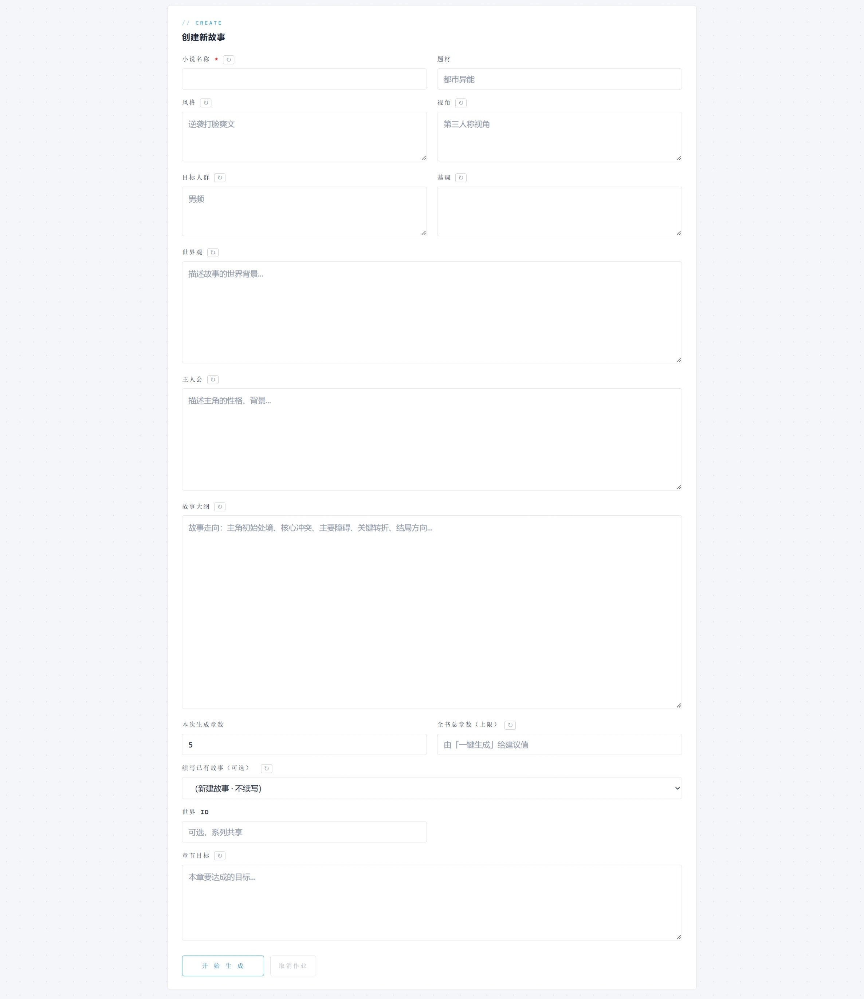

# novel-factory

**长篇小说生成的工程参考实现**——四层规划（卷→弧→段→章）、三账本记忆、候选盲评、伏笔排期清账、时序锚、26 项量化体检。

> 这不是"一键生成小说"的工具，而是一套解决长篇连载工程问题的框架——跨章一致性、伏笔遗忘、节奏失序、进度漂移——每类问题都拆成**可校验机制**，而不是继续往提示词里堆约束。
> 目标读者：想研究或构建 AI 长篇生成管线的开发者。

**技术栈**：Java 17 · Spring Boot 3.4.3 · Spring AI 1.0 · Maven 多模块 · Qdrant（可选）· 原生前端
**规模**：6 个 Maven 模块 · 主代码 3.0 万行 / 测试 2.3 万行 · 106 个测试类 1114 个用例



---

## 最低准备：你需要什么才能跑起来

| 档位 | 需要准备 | 能得到什么 |
|---|---|---|
| **必需（最低）** | 一个 OpenAI 兼容端点的 **API Key** | 全流程可跑通。文件侧记忆完整工作：三账本、章节摘要、伏笔排期、一致性索引、批末体检——长篇要的那套约束一个都不少 |
| **推荐（质量档）** | 上面那个 Key + 一个 **embedding 模型 API Key** + 一个 **Qdrant**（Docker 一条命令） | 再开启**向量增强**：跨章记忆的语义唤醒、动态参考资料按需注入。这两项直接决定"写到第 60 章还记不记得第 8 章埋的线" |

只准备第一档也完全可用，缺 Qdrant 时系统以"无向量增强"模式运行，并且批末体检的**「无检索唤醒章数占比」指标会明确告诉你哪几章是裸跑的**——不静默降级，是这套设计的通则。

Qdrant 用 Docker 起一行就够：

```bash
docker run -d --name qdrant -p 6333:6333 -p 6334:6334 qdrant/qdrant
```

> 提示：两个 Key 可以是同一个供应商（如 DashScope）的同一把 Key——`LLM_API_KEY` 同时供对话与嵌入使用；要分开也可以，见[快速开始](docs/quickstart.md)。

## 它解决什么问题

长篇连载（50 万字以上）靠单次提示无法保证质量，真正的难题是**跨章的工程约束**。本项目把每类约束做成机制：

| 长篇难题 | 对应机制 |
|---|---|
| 写到后面人物状态、持有物、时间线自相矛盾 | 三账本（角色/物品/势力）+ 一致性索引 + 时序锚（境界式锁定） |
| 账本/摘要"记录了正文里没有的事" | **证据链机械校验**（8 档匹配）——模型必须给出正文原文引证，匹配不上就不入账 |
| 伏笔"埋了就忘"或"埋了立刻收" | 伏笔排期表（PLANNED→PLANTED→PAID/MISSED 状态机）+ 卷末清账裁决 + 动态权重（积压到阈值必须评估）+ 写手视图去元信息 |
| 写手"提前说漏嘴"谜底 | 禁泄清单：对谜底关键词在正文里**逐字扫描**，命中即 BLOCKING（不做语义判断，宁漏勿误报） |
| 模型自我修正的同质化陷阱 | 候选盲评：低置信章触发异模型整章重写 + 机械门禁 + 异族评审 |
| 反复用同一批套话与同一套情节 | 疲劳词表（内置 60+ 中文套话，可外部覆盖）+ 已用情节模式黑名单（舞台复用/同型冲突方/能力展示章数） |
| 计划写了、正文没写 | 计划遵循度：正文与计划事件的**最长公共子串**覆盖率，低于 0.6 即触发加审 |
| 时间/年龄漂移 | 时序锚 v2：计划声明的 timeAdvance 是唯一合法推进通道，审计回验 |
| "这批比上批是好是坏"无法归因 | 批末体检：26 项量化指标，每项带历史基线与可执行建议 |
| 长跑批中途失败、无人值守烧钱 | 逐章检查点/回滚 + 人工审批挂起 + token 预算熔断（命中后**当前章写完即停**，不留半截） |

## 几个不常规的设计取舍

这些是本项目与"多套几层提示词"最不一样的地方，也是它在长跑中不容易崩的原因：

**1. 能机械校验的，绝不交给 LLM 判断。**
摘要和账本最容易编造"正文里没有的事实"，所以每条状态都必须附 ≤50 字正文引证，再用 8 档匹配（精确→归一化→分段→短语覆盖→锚定→跨度）判定引证是否真实存在——"放宽的是表述，不是事实有无"。禁泄是逐字 `indexOf` 扫描，计划覆盖率是 LCS，重复用语是词表统计。**判断标准始终是可复算，而不是"模型觉得像"。**

**2. 失败语义刻意不对称——该硬失败的地方不许静默降级。**
向量资料检索失败会**直接终止作业**（注释写明：静默降级会让作业在低质量注入下跑完）；而 LLM 选择资料失败则静默返回空、不阻塞。模型降级链里唯一不换模型的是 `CONTENT_POLICY`（内容审计与换哪个模型无关）。预算熔断、检查点、自动续批则全部 fail-soft，不反噬主流程。哪里该硬、哪里该软，是逐处设计过的。

**3. 状态机与生命周期，而不是散落的标志位。**
写作模式按契约完整度自动判定（FREE / SCAFFOLDED / RECOVERY，缺计划就收紧而非自由发挥）；伏笔走四态；质量债用"连续 2 章无同维度复发"验证式核销，**没有验证信号的债永不核销**（不伪造结论）；全书完结上限是 sticky 的——只能下调不能抬高。

**4. 状态尽量做成纯函数，可确定性重算。**
伏笔权重 `score = 重要性×10 + 滞留章数×5`，续批决策 `decide(...)` 同样是纯函数——零新增存储，任何时刻都能从摘要重算，不存在"状态漂移需要修数据"。

**5. 提示词预算是"块优先级淘汰"，而不是一刀切截断。**
前缀由 8+ 个块拼成（末态红线/记忆/风格/一致性/禁泄/情节黑名单…），每块有独立封顶，但**封顶之和会击穿窗口**。所以装配层有总额预算，超预算时按块优先级淘汰，且**渲染顺序与淘汰次序分离**——丢谁和排谁在前是两件事。禁泄块标记为不可截断（截断会静默丢词），放不下就整块弃并**在日志点名**"依赖下游兜底"。预算日志强制自洽，可脚本对账。

**6. 错误分类驱动重试与降级，而不是无脑重试。**
供应商报错被分为 7 类，每类带两个正交布尔——"同模型重试是否有意义"和"换模型是否有意义"。`UPSTREAM_INTERNAL`（500/engine abort）被特别归为"换模型比原样重试更有效"——这条来自实测：某个模型跑 795 秒后被上游 abort。降级链**硬上限 3 个**，防止一条长链一次失败烧掉整串费用。

**7. 有校准设施，而不是只能靠感觉调参。**
审校判据留了 A/B 变体开关（默认 A 与生产逐字节一致）；"修订耗尽仍未解决的 BLOCKING"整包回流成离线校准集；另有一套需显式开关的评测框架（跨系统盲评、审校校准、运行时采样），共 6 个类 1428 行。

## 和"逐章循环"式生成的区别

市面上多数小说生成工具是同一个形态：一句话设定 → 逐章循环生成 → 输出全文，跨章状态靠"把前文塞进上下文"。这个形态有三条假设，会随篇幅增长逐条失效：

1. **上下文装得下**——长到一定程度必须截断，截断即遗忘，且遗忘是静默的；
2. **模型自评能代替机械校验**——同一模型既写又评会偏向自己的措辞和结构，越改越同质；
3. **"生成完"就是终点**——没有可归因的质量基线，所以"这批比上批是好是坏"永远说不清，调参只能靠感觉。

本项目的取舍是：能机械校验的一律不进提示词；账本、伏笔、时间线全部落成可 diff 的文件；每批产出体检报告，让"变好还是变坏"可归因。**判断标准不是"能不能生成"，而是"能不能定位到是哪一层机制没生效"**。

## 工程规模

工程深度不看行数，但下面这些数字能说明机制是真的在跑：

| 项 | 数量 |
|---|---|
| Maven 模块 | 6（types / api / domain / infrastructure / trigger / app） |
| 主代码 / 测试代码 | 30,729 行 / 23,017 行 |
| 测试类 / 用例 | 106 个 / 1114 个（全绿） |
| 批末体检指标 | 26 项 |
| 质量门禁策略 | 15 个（`quality/*Policy`；该包共 21 个类） |
| 生成管线节点 | 12 个（`node/*Node`） |
| 记忆层 | 17 个类（`memory/`） |
| 提示词策略 | 8 个（反 AI 腔、防注水、钩子技法、视角纪律……） |
| 校准 / 评测框架 | 6 个类、1428 行，其中 4 个需显式开关才运行 |

## 快速开始

四步：**配 Key → 打包 → 启动 → 打开工作台**。完整版（含截图与排错）见[快速开始](docs/quickstart.md)。

```bash
# 1) 配置密钥（唯一必改项）——二选一：
export LLM_API_KEY=sk-你的密钥
#   或复制 config/application-local.example.yml 到
#   novel_factory-app/src/main/resources/application-local.yml 后填入
#   （该文件名已被 .gitignore 排除；文件里的值会覆盖环境变量，所以只启用你要改的项）

# 2) 打包（首次约 20 秒，不需要预先安装任何模块）
mvn -pl novel_factory-app -am clean package -DskipTests

# 3) 启动
java -jar novel_factory-app/target/novel_factory-app.jar

# 4) 打开工作台
#    http://localhost:8080
```

> 开发时想反复重启，用 `mvn install -DskipTests` 装齐 6 个模块一次，之后 `mvn -pl novel_factory-app spring-boot:run` 即可（改代码不用重打包）。
> 完整测试套件：`mvn test`（1114 个用例，1~2 分钟）。

每批（界面默认 5 章）结束后看**批末体检报告**——26 项指标 + 可执行建议，这就是本系统的仪表盘。

## 批末体检长什么样

每项指标三列：**当前值 ｜ 目标（含历史基线）｜ 明细**，级别 OK / WATCH / DEGRADED / CRITICAL，尾部附建议。真实示例（节选）：

```text
OK      账本完整度       94.06%（目标 ≥90%） ｜ 严格 523 / 放宽 47 / 挂起 11
OK      对白轮次密度     22.50次/千字（目标 ≥9）
WATCH   候选选优触发率    52%（目标 ≤30%） ｜ 触发 39 / 65 章
DEGRADED 进度对齐        7段（目标 ≤1 段） ｜ 第 65 章按大纲应处【61-70章 2009年/11岁】段
建议：进度滞后约 6 年：……两条出路：①规划层加速（跳月/压缩日常）；
②承认慢节奏，重排大纲章段预算。不应长期维持现状——路标与正文漂移会越滚越大。
```

每条 DEGRADED 都对应一个可执行的下一步——这是本系统与"生成完就结束"的工具最大的区别。

## 架构

六个 Maven 模块，依赖单向：`types`（枚举/值对象）与 `api`（DTO）不依赖任何内部模块；`domain` 只依赖这两个，承载全部机制（管线节点、质量策略、记忆层、提示词装配）；`infrastructure`（文件仓库 / Qdrant / LLM·Embedding 网关）与 `trigger`（HTTP 端点）并列依赖 `domain`；`app` 装配二者并启动。

- **存储**：文件仓库——`docs/workspace/stories/` 下 JSON（正文、摘要、三账本、蓝图、检查点），全部可 git、可 diff、可手工修。写入走"临时文件 + 原子替换"并按故事加锁；记忆类文件损坏即硬失败（静默读空等于丢账本），观测类文件损坏仅告警。
- **前端**：原生 HTML/CSS/JS（无构建步骤），随 jar 由后端同源提供，所以打完包只需要一个进程。
- **可换的模型**：场景级路由——每个场景（章节计划/正文/审校/评审……）可独立配模型、温度、思考开关，也可按场景配不同的 base-url 与 api-key，用于让评审场景指向异族模型以保证盲评中立。

详细设计（管线节点链、20 项机制的逐一说明、存储目录契约）：[架构与机制](docs/architecture.md)

## 模型实测

场景级模型路由（每场景可独立配模型/温度/思考开关），作者账号实测结论：

| 场景 | 实测较优 | 备注 |
|---|---|---|
| 章节计划 | qwen3.7-max | 关键事件供给稳定；温度固定 1.0 |
| 正文 | glm-5.2 | 年代质感好；偶发段落坍缩已有机械重排兜底 |
| 审校 | qwen3.7-max | 抓出过禁泄泄露与年龄幻觉 |
| 候选重写/评审 | qwen3.8-max + deepseek-v4.1-flash | 异族评审防自偏好 |

选型理由、降级链、单章成本与踩过的坑（含实测算力统计）：[模型与成本](docs/models-and-costs.md)

## 已知限制

- 面向**中文长篇**设计（分词、账本、体裁模板均以中文假设为前提）；
- 单机文件存储：多机协作、多人共写不在当前范围内；
- 每章生成成本 8-25 万 token（视质量档位）——这是"全链路审校+候选"的定价，预算敏感请调低候选触发；
- 大纲（chapterGoal）需要作者按"章段+时间标记"格式编写；
- 候选盲评与异族评审走独立模型配置（`scene-models.chapter-rewrite` 与 `chapter-judge`）。只有单一模型族可用时，把 `candidate.enabled` 置为 `false`——保持默认的 `true` 会在评审阶段空转失败；
- 本协议只覆盖**代码**：生成小说内容的版权归属由「谁运行 + 所用模型服务商的条款」决定，本仓库不做任何主张——商用或公开发布前，请自行确认所用模型方的输出使用权与发布平台规则。

## 路线图

- [x] 配置页 UI 化（密钥/模型表单化，嵌入模型分区）
- [x] 批末体检报告前端渲染（26 项指标上页面）
- [x] 前端随 jar 同源提供（打包后单进程即可用）
- [x] 本地密钥覆盖文件（`application-local.yml`）真正生效
- [ ] 动态资料检索失败 fail-open 开关
- [ ] 大纲解析器的更多格式兼容
- [ ] 多机/多人协作（当前为单机文件存储）

## License

[Apache-2.0](LICENSE)
