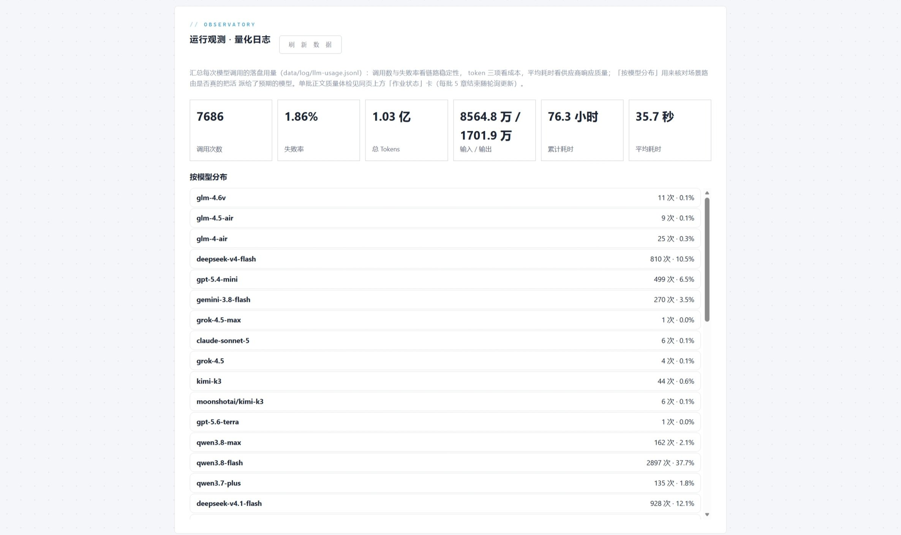

# 模型与成本

本文档记录模型路由的配置方式、实测选型结论、token 成本结构，以及**踩过的坑**。所有"实测"结论都来自作者账号的真实运行记录，不是通用建议——换供应商前请以自己的复测为准。

- [1. 场景级模型路由](#1-场景级模型路由)
- [2. 选型原则与降级链](#2-选型原则与降级链)
- [3. 成本结构与预算熔断](#3-成本结构与预算熔断)
- [4. 实测运行统计](#4-实测运行统计)
- [5. 坑清单](#5-坑清单)
- [6. 错误分类与重试策略](#6-错误分类与重试策略)

---

## 1. 场景级模型路由

每个生成场景可以独立指定模型、温度、思考开关，以及**独立的 base-url 与 api-key**。生效优先级：

```
设置页运行时覆盖  >  场景 yml（scene-models）  >  全局默认（ai-api + chat-model）
```

场景自带 base-url/api-key 的用途是**让某几个场景走第二模型族**——最典型的是评审场景指向异族模型，保证盲评中立。这套机制受设置页的「启用场景级 API」总开关管辖，关闭时所有场景强制走全局地址与密钥。

默认配置（`novel-generation.yml`）：

| 场景 | 模型 | max-tokens | 温度 | 思考 |
|---|---|---|---|---|
| `stage-blueprint` 阶段蓝图 | DeepSeek-V4-Pro | 16384 | 0.7 | 关 |
| `chapter-plan` 章节计划 | **qwen3.7-max** | 32768 | **1.0** | 开 |
| `chapter-beats` 章节节拍 | deepseek-v4.1-flash | 2048 | 0.3 | 关 |
| `chapter-content` 章节正文 | glm-5.2 | 16384 | 0.5 | 关 |
| `chapter-rewrite` 候选重写 | qwen3.8-max | 16384 | 0.7 | 关 |
| `chapter-judge` 候选评审 | deepseek-v4.1-flash | 1024 | 0.2 | 关 |
| `audit` 章节审校 | **qwen3.7-max** | 16384 | 0.1 | 关 |
| `paragraph-audit` 段落密度审校 | deepseek-v4-flash | 4096 | 0.1 | 关 |
| `revise` 章节修订 | qwen3.7-plus | 16384 | 0.4 | 关 |
| `summary` 摘要 | deepseek-v4-flash | 16384 | 0.2 | 关 |
| `ledger-adjudicate` 账本裁决 | deepseek-v4-flash | 4096 | 0.1 | 关 |
| `foreshadow-settlement` 伏笔结算 | deepseek-v4.1-flash | 16384 | 0.1 | 关 |
| `exit-review` 阶段出口评审 | deepseek-v4-pro | 16384 | 0.1 | 关 |
| `finale-review` 完本评审 | deepseek-v4-pro | 16384 | 0.1 | 关 |
| `ref-select` 资料选择 | deepseek-v4-flash | 2048 | 0.1 | 关 |
| `quality-review` 全书质量评分 | DeepSeek-V4-Pro | 4096 | 0.1 | 关 |

温度不是随手填的：**计划场景必须 1.0**（要让方向分支真正产生差异，见 [§5](#5-坑清单)）；审校类压到 0.1 是为了复现性。

## 2. 选型原则与降级链

### 2.1 主模型怎么选（实测结论）

| 场景 | 实测较优 | 理由 |
|---|---|---|
| 章节计划 | qwen3.7-max | 关键事件供给稳定——计划层最怕"给不出可执行的关键事件"，这比文笔重要 |
| 正文 | glm-5.2 | 年代质感好；偶发段落坍缩已有机械重排兜底 |
| 审校 | qwen3.7-max | 抓出过禁泄泄露与年龄幻觉 |
| 候选重写 / 评审 | qwen3.8-max + deepseek-v4.1-flash | **刻意分属两族**：异族评审防止自偏好 |

一句话原则：**规划要"给得出可执行的下一步"，正文要"文风匹配题材"，审校要"抓得住硬错误"**——三者对模型的要求不同，所以不做"一个模型全包"。

### 2.2 降级链

主模型失败时按链切换模型，而不是无限重试同一模型：

```yaml
model-fallbacks:
  chapter-plan: [ deepseek-v4-pro, qwen3.8-flash ]
  audit:        [ deepseek-v4.1-flash ]
  # …其余场景见 novel-generation.yml
```

两条硬规则：

1. **链长硬上限 3 个。** 防止一条长链在连续失败时把整串模型的费用一次烧掉。
2. **备选尽量跨模型族。** 免费档/上游的拒绝常**按模型计量**，同族备选可能共享同一份额度而一起失败——跨族才真正提高成功率。

备选模型会继承主模型的全部参数（max-tokens / 温度 / 思考开关 / base-url / api-key / completions-path），只替换模型名。

**唯一不降级的情况是 `CONTENT_POLICY`**：内容策略拒绝与换哪个模型无关，换模型重试只是白烧一次调用。

## 3. 成本结构与预算熔断

### 3.1 单章成本

**实测每章 8–25 万 token**（视质量档位）。这是"全链路"的定价——一章正文不止一次调用：

```
章节计划 → 节拍 → 正文生成（含重试）→ 段落密度审校 → 审校 → 修订 → 复审 → 候选重写/评审（低置信时）
```

预算敏感时，**先调低候选触发**（`candidate.trigger-on-*`），它是最贵且最可省的一环；其次是段落密度审校。

### 3.2 成本结构：输入远大于输出

从实测统计看，**输入 tokens 约占总量的 83%**（输入 8564.8 万 / 输出 1701.9 万 / 合计约 1.03 亿）。这是分层记忆前缀设计的必然结果——每章正文都带着末态红线、记忆块、一致性索引、禁泄清单等 8+ 个块的完整前缀。

所以优化成本的第一顺位不是"换个便宜的输出模型"，而是**看批末体检里的前缀预算日志**：

```
grep "前缀预算" data/log/log_info.log
```

每次装配都会输出一行 INFO（各块字数与占比），预算触及核心块或占比 ≥90% 时升 WARN。日志强制自洽（合计 = 块内容字 + 分隔字，逐块清单之和恰等于块内容字），可以直接脚本对账。**看到 WARN 时先回查块膨胀来源，而不是直接调大上限。**

### 3.3 预算熔断

```yaml
story:
  module:
    budget:
      warn-total-tokens: 1200000    # 每作业累计：告警一次
      hard-total-tokens: 2500000    # 每作业累计：命中即停
```

- 按**作业**累计（不是全局），jobId 取自 MDC 的 `trace-id`。
- **成功与失败的调用都计入**——失败调用照样烧钱，不计就漏账。
- 用量观测与预算开关**解耦**：没配阈值也照常累计，所以运行观测卡片永远有数据。
- 命中硬上限时**当前章写完即停**（不是硬杀）：此前章节都已逐章落盘，可以直接续写。

按 8–25 万 token/章估算，2.5M 的硬上限大约允许单次作业跑 10–30 章。无人值守续批（`run-plan`）默认关闭，开启前请先确认这里的阈值。

## 4. 实测运行统计

作者账号的累计运行观测（工作台「运行观测（量化日志）」卡片，数据源 `llm-usage.jsonl`）：



| 指标 | 值 |
|---|---|
| 调用次数 | 7,686 |
| 失败率 | 1.86% |
| 总 tokens | 1.03 亿（输入 8564.8 万 / 输出 1701.9 万） |
| 累计耗时 | 76.3 小时 |
| 平均单次调用耗时 | 35.7 秒 |

**1.86% 的失败率是这套降级设计的直接产物**——单模型裸跑的真实失败率远高于此，差额由错误分类 + 跨族降级链 + 分层重试吃掉。

按模型的调用分布也说明了选型过程（节选）：`qwen3.8-flash` 37.7%（摘要/节拍/结算这类高频小调用）、`deepseek-v4.1-flash` 12.1%、`deepseek-v4-flash` 10.5%、`gpt-5.4-mini` 6.5%、`gemini-3-flash` 3.5%、`qwen3.8-max` 2.1%——**高频小任务用便宜模型、低频高价值判定用 pro 档**，是这个分布背后的分配原则。

## 5. 坑清单

这些都是实际撞过、已在配置里写死规避的：

**1. 强制思考模型不能用于每批必调的路径。**
`kimi-k3` 是强制思考模型且**不支持 `thinking_budget`**——与早前 `glm-5.3` 事件同型。放在章节计划这种每批必调的位置，会在不需要深思的批上白白烧掉思考预算。计划路径因此用 qwen3.7-max + `enable-thinking: true`（可控）。

**2. 计划场景温度必须 1.0。**
规划需要产生方向差异，温度低了会退化成同一套方案；但普通对话场景用 0.7 就够。

**3. 上游 500 / engine abort 换模型比原样重试有效。**
实测某模型跑 **795 秒**后被上游 abort。这类错误被单独归为 `UPSTREAM_INTERNAL`，语义是"换模型"，而不是"重试"——原样重试大概率再等 795 秒再挂一次。

**4. 免费档/上游拒绝按模型计量。**
所以降级链的备选必须跨族，同族备选会一起失败。

**5. 换 embedding 模型必须重嵌。**
**维度相同不代表向量空间兼容**——旧向量必须整体作废重建。`embedding-api.dimensions` 显式钉死维度，是为了不依赖供应商默认值漂移。

**6. embedding 的 base-url / api-key 不吃 `LLM_BASE_URL` 环境变量。**
默认配置里 `embedding-api` 是写死的 DashScope 地址。换供应商时必须显式覆盖，或直接在设置页的「向量检索分区」里改（按调用重建客户端，保存即生效）。

**7. 配置留空会盖掉默认值。**
Spring 的 `${VAR:default}` 只在变量**不存在**时用默认值，存在但为空串时用空值。所以在 `application-local.yml` 里**一行都不要留空**——不想改的项保持注释。

## 6. 错误分类与重试策略

`LlmErrorClassifier` 把供应商报错分成 7 类，每类带两个**正交**布尔——`retryable`（同模型重试是否有意义）与 `modelLevel`（换模型是否有意义）：

| 分类 | 典型触发 | 同模型重试 | 换模型 |
|---|---|---|---|
| `TRANSIENT` | 超时、`HttpTimeoutException`、取消 | ✅ | ✅ |
| `QUOTA_EXHAUSTED` | 额度耗尽 / 欠费 | ❌ | ✅ |
| `MODEL_NOT_FOUND` | 模型下线 / 名称错 | ❌ | ✅ |
| `UPSTREAM_INTERNAL` | 500 / engine abort / `InternalError.Algo` | ❌ | ✅ |
| `INVALID_REQUEST` | 请求体不合法 | ❌ | ❌ |
| `CONTENT_POLICY` | 内容策略拒绝 | ❌ | ❌（**唯一不降级的类别**） |
| `UNKNOWN` | 兜底 | 视配置 | 视配置 |

实现上有三个非显然点：

- **规则表顺序敏感**：`content_policy_violation` 的判定必须先于宽泛的 403 / 额度判断，否则会被误分类。
- **遍历 cause 链**：HTTP 状态码常常埋在内层 cause 里，所以要拼接整条 cause 链的 message 再匹配，深度上限 8 防止自引用循环。
- **异常类型优先于 message 关键词**：`HttpTimeoutException` / `CancellationException` 直接判 `TRANSIENT`，不受 message 里恰好出现的其他关键词影响。

传输层重试已从 Spring AI 的默认 10 次**调低到 3 次**（`spring.ai.retry.max-attempts`）——把重试权收归业务层，避免 5xx 时在传输层白烧多次长调用；业务层再按上表决定"重试"还是"换模型"。
