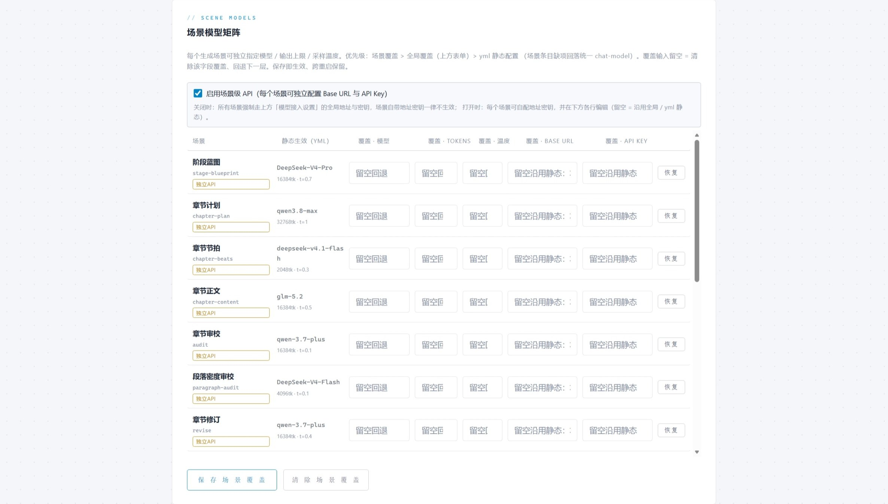

# 快速开始

从零到跑出第一批章节，大约 10 分钟。本文档按"**最少准备什么 → 怎么启动 → 怎么用 → 出问题怎么办**"排列。

- [1. 你需要准备什么](#1-你需要准备什么)
- [2. 启动](#2-启动)
- [3. 配置密钥](#3-配置密钥)
- [4. 打开工作台](#4-打开工作台)
- [5. 创建第一个故事](#5-创建第一个故事)
- [6. 看批末体检](#6-看批末体检)
- [7. 调模型（可选）](#7-调模型可选)
- [8. 启用向量增强（可选，推荐）](#8-启用向量增强可选推荐)
- [9. Docker 部署](#9-docker-部署)
- [10. 排错](#10-排错)

---

## 1. 你需要准备什么

| 档位 | 需要准备 | 能得到什么 |
|---|---|---|
| **必需** | JDK 17+ / Maven 3.9+，以及**一个 OpenAI 兼容端点的 API Key** | 全流程可跑通，文件侧记忆（三账本/摘要/伏笔排期/一致性索引/批末体检）一个不少 |
| **推荐** | 上面那个 Key + **embedding 模型 API Key** + **Qdrant** | 向量增强：跨章记忆的语义唤醒 + 动态参考资料按需注入 |

用 DashScope 的话，对话与嵌入可以是同一把 Key（默认配置里 `embedding-api.api-key` 就回落到 `LLM_API_KEY`）。要分开配置见 [§3](#3-配置密钥)。

Qdrant 一条命令起（没装 Docker 可以先跳过，不影响启动）：

```bash
docker run -d --name qdrant -p 6333:6333 -p 6334:6334 qdrant/qdrant
```

> 6334 是 gRPC 端口（应用用这个），6333 是 REST/dashboard（浏览器看这个）。

## 2. 启动

```bash
git clone https://github.com/YonRen-code/Novel-factory.git
cd Novel-factory

# 打包（首次约 20 秒，不需要预先安装任何模块）
mvn -pl novel_factory-app -am clean package -DskipTests

# 启动
java -jar novel_factory-app/target/novel_factory-app.jar
```

看到 `Started Application` 就成了。**这条命令从零开始就能跑**——`-am` 会把 6 个模块一起构建，不需要先 `mvn install`。

> 开发时想反复重启（改代码不重打包）：先 `mvn install -DskipTests` 装齐模块一次，之后用
> `mvn -pl novel_factory-app spring-boot:run`。
>
> 注意 `mvn -pl novel_factory-app -am spring-boot:run` **不可用**：`-am` 会把根聚合 pom 拉进反应堆，`spring-boot:run` 在根 pom 上先执行一次并因找不到主类而失败。

跑测试套件（1114 个用例，1~2 分钟）：

```bash
mvn test
```

## 3. 配置密钥

**二选一**，改完重启生效。

### 方式 A：环境变量（最快）

```bash
# Linux / macOS
export LLM_API_KEY=sk-你的密钥
export LLM_BASE_URL=https://dashscope.aliyuncs.com/compatible-mode   # 可选，不设则用这个默认值

# Windows PowerShell
$env:LLM_API_KEY="sk-你的密钥"
```

环境变量是**当前终端会话级**的，关掉终端就没了；长期使用建议方式 B。

### 方式 B：本地覆盖文件（持久，推荐）

```bash
cp config/application-local.example.yml novel_factory-app/src/main/resources/application-local.yml
```

然后编辑该文件，**只改 `api-key` 一行**即可。示例文件里其余项都是注释状态，需要时再放开。

这个文件被 `.gitignore` 排除（`application-local.yml` / `*.local.yml`），可以安全放密钥。加载方式是在 `application-dev.yml` 里以 `optional:classpath:application-local.yml` 导入的——排在默认值之后，所以它能覆盖 `novel-generation.yml`；文件不存在也不报错。

> ⚠️ 一个真实的坑：Spring 的 `${VAR:default}` 只在变量**不存在**时用默认值，**变量存在但为空字符串时会用空值**。所以本地覆盖文件里**一行都不要留空**——不想改的项请保持注释状态，否则会把你从环境变量或默认值来的配置盖成空。

### 两个 Key 分开配置

默认 `embedding-api.api-key` 与 `base-url` 是写死的（不读 `LLM_BASE_URL`），所以换供应商或想用不同的 Key 时必须显式覆盖：

```yaml
story:
  module:
    embedding-api:
      base-url: https://your-provider.example.com/v1
      api-key: sk-嵌入模型的独立密钥
```

> 换 embedding 模型**必须重嵌**：维度相同**不代表**向量空间兼容，旧向量必须整体作废重建。

## 4. 打开工作台

浏览器打开 **http://localhost:8080**（前端随 jar 同源提供，不需要另起静态服务器）。

页面分三个页签：`01 生成` / `02 小说库` / `03 设置`。

## 5. 创建第一个故事

在 **01 生成** 页：


1. **一键生成设定集**（可选但推荐）：点几个题材标签，点「一键生成设定集」，AI 会产出一份设定集并回填下面的表单。只对大纲不满意时，用「只重生成大纲」单独重写它，其余字段不动。

   

   有两层"保持"机制，避免重生成时把已经改好的东西顺手改掉：**风格 / 目标人群 / 基调 / 视角** 四个字段只要你已经定稿，重生成时会作为"用户已定偏好"上报，模型不会去动它们；其余字段则由请求里的重生成范围显式限定。

2. **填基本设定**：小说名称（必填）、题材、风格、视角、目标人群、世界观、主人公、故事大纲。

   题材标签是刻意挑选过的——它们命中的是内置题材资料包（玄幻 / 悬疑 / 言情三族）的关键词表，不命中的题材会退回到通用资料。

3. **本次生成章数**：默认 5 章。**全书总章数（上限）** 留空则由设定集给建议值——注意这个上限一旦写入就是 sticky 的，之后只能下调不能抬高（完结保护）。

4. 点 **开始生成**，作业进入队列。页面上的作业状态卡会持续轮询进度，逐章落盘，中途失败可从已完成章续写。

生成过程中可以随时看 **运行观测（量化日志）** 卡片，它汇总 `llm-usage.jsonl`：调用次数、失败率、token 总量、耗时分布，以及按模型的调用分布。


## 6. 看批末体检

**每批结束后一定要看这个**——26 项量化指标，每项三列（当前值 ｜ 目标含历史基线 ｜ 明细），级别 OK / WATCH / DEGRADED / CRITICAL，尾部给可执行建议：

```text
OK      账本完整度       94.06%（目标 ≥90%） ｜ 严格 523 / 放宽 47 / 挂起 11
OK      对白轮次密度     22.50次/千字（目标 ≥9）
WATCH   候选选优触发率    52%（目标 ≤30%） ｜ 触发 39 / 65 章
DEGRADED 进度对齐        7段（目标 ≤1 段） ｜ 第 65 章按大纲应处【61-70章 2009年/11岁】段
建议：进度滞后约 6 年：……两条出路：①规划层加速（跳月/压缩日常）；
②承认慢节奏，重排大纲章段预算。不应长期维持现状——路标与正文漂移会越滚越大。
```

报告在作业状态卡里内嵌渲染，落盘在故事的 `record/run-XXXX/` 下。

**每条 DEGRADED 都对应一个可执行的下一步**，这是用它调参的入口。几个值得记住的指标：

| 指标 | 什么时候该警惕 |
|---|---|
| 无检索唤醒章数占比 | >0 说明那几章是在**没有跨章记忆**的情况下生成的（向量链路在抖，或没配 Qdrant） |
| 修订验证未跑成占比 | >0 说明有 BLOCKING 结案是**未经验证**的 |
| 候选选优触发率 | 长期 >30% 说明初稿质量不稳定，值得先查提示词而不是加候选 |
| 伏笔未标注占比 | 偏高时**跨度类指标不可信**——样本已被掏空 |
| 进度对齐 | 路标与正文漂移，越拖越难补 |

## 7. 调模型（可选）

**03 设置** 页可以完全用表单配置，改动落到运行时覆盖文件，保存即生效、无需重启。



- **模型接入设置**：全局 base-url / api-key / 模型 / 最大输出 token。
- **向量检索分区**：embedding 的独立地址、密钥、模型、维度（按调用重建客户端，改完立即生效）。
- **场景模型矩阵**：每个生成场景独立指定模型与采样参数。优先规则是 **设置页覆盖 > 场景 yml > 全局默认**。

场景与默认模型（`novel-generation.yml`）：

| 场景 | 默认模型 | 温度 |
|---|---|---|
| 阶段蓝图 `stage-blueprint` | DeepSeek-V4-Pro | 0.7 |
| 章节计划 `chapter-plan` | qwen3.7-max | 1.0 |
| 章节节拍 `chapter-beats` | deepseek-v4.1-flash | 0.3 |
| 章节正文 `chapter-content` | glm-5.2 | 0.5 |
| 章节审校 `audit` | qwen3.7-max | 0.1 |
| 段落密度审校 `paragraph-audit` | deepseek-v4-flash | 0.1 |
| 章节修订 `revise` | qwen3.7-plus | 0.4 |
| 章节重写 `chapter-rewrite` / 评审 `chapter-judge` | qwen3.8-max / deepseek-v4.1-flash | — |

调参细节、降级链与避坑清单见 [模型与成本](models-and-costs.md)。

## 8. 启用向量增强（可选，推荐）

1. 起 Qdrant（见 [§1](#1-你需要准备什么)）
2. 填好 embedding 的 base-url / api-key（见 [§3](#3-配置密钥)）
3. 重启应用

连接参数在 `novel-generation.yml`（如需改动，请用本地覆盖文件）：

```yaml
story:
  vector-store:
    host: localhost
    port: 6334        # gRPC；6333 是 REST/dashboard
```

**没配 Qdrant 也完全能跑**：系统以"无向量增强"模式运行，文件侧记忆承载全部功能。区别会在批末体检的「无检索唤醒章数占比」上显形——它明确告诉你哪几章是裸跑的，不会静默降级。

关于版本：Qdrant 客户端版本与服务端差得较多时启动会打兼容性告警（例如客户端 1.14 对服务端 1.19）。这个告警不影响启动，但**如果检索行为异常，请把服务端换成与客户端同大版本、小版本差 ≤1 的版本**（或相应升级客户端依赖 `io.qdrant:client`），再重新索引。

## 9. Docker 部署

```bash
# 1) 先打包
mvn -pl novel_factory-app -am clean package -DskipTests

# 2) 构建镜像
cd novel_factory-app && ./build.sh && cd ..

# 3) 起容器（脚本会挂载数据目录，并透传 LLM_API_KEY）
export LLM_API_KEY=sk-你的密钥
bash docs/dev-ops/app/start.sh
```

工作台在 **http://localhost:8080**。两个数据目录被挂载出来——`data/`（日志）与 `docs/workspace/`（故事仓库），**不挂的话容器一删，正文与三账本全丢**。

停止：

```bash
bash docs/dev-ops/app/stop.sh
```

## 10. 排错

| 现象 | 原因与处理 |
|---|---|
| `Could not find artifact cn.novel.yonren:novel_factory-*` | 用了不带 `-am` 的 `mvn -pl novel_factory-app ...`。要么加 `-am`，要么先 `mvn install -DskipTests` |
| `Unable to find a suitable main class` | 用了 `mvn -pl novel_factory-app -am spring-boot:run`。见 [§2](#2-启动) 的说明，换命令 |
| `http://localhost:8080` 打不开 / 404 | 端口被占用，或前端资源缺失。正常启动日志里应有 `Adding welcome page: class path resource [static/index.html]` |
| 生成作业失败：缺少密钥 / 401 | `LLM_API_KEY` 没传到运行进程（环境变量是会话级的），或本地覆盖文件里 `api-key` 留了空 |
| 批末体检「无检索唤醒章数占比」很高 | Qdrant 没起或 embedding 配置不对。看日志里 `RECALL_DEGRADED` 的归因 |
| 候选盲评每章都失败 | 只配了一个模型族。把 `candidate.enabled` 置为 `false` |
| 换过 embedding 模型后检索质量异常 | 换模型必须**重嵌**——维度相同不代表向量空间兼容 |
| 想确认知识库/账本落在哪 | `docs/workspace/stories/<yyyyMMdd>-story-XXXX/`，全是可读 JSON，可以直接 git diff |

先看日志：控制台之外还有 `data/log/log_info.log` 与 `data/log/log_error.log`。前缀预算、降级归因这类信息都是按关键字打点的，可以直接 grep（如 `前缀预算`、`RECALL_DEGRADED`、`AUDIT_VERIFY_DEGRADED`）。
